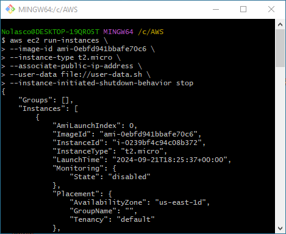
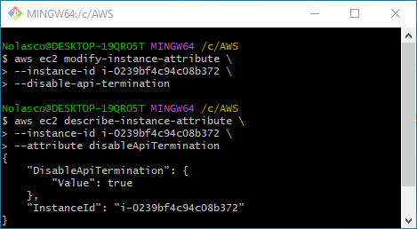
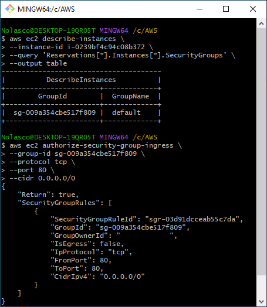
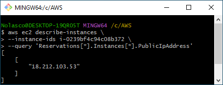
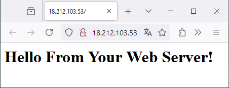
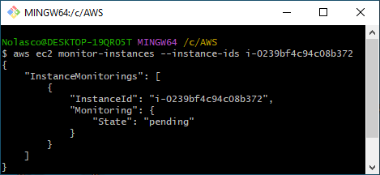
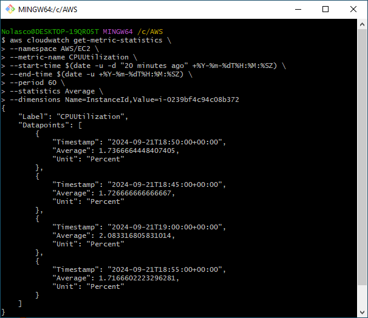
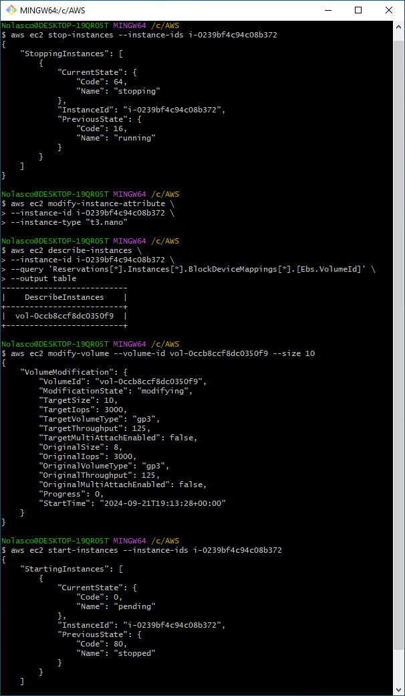
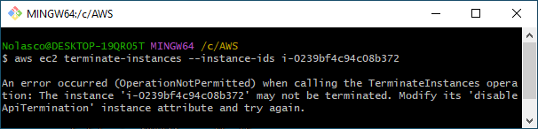
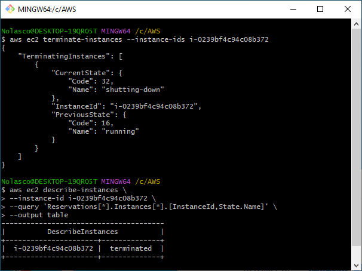

# AWS EC2 Introduction Lab

<div align="center">
  
</div>

This lab provides a guide to:
- Launching an Amazon EC2 instance with an Apache Web Server
- Monitoring the CPU performance of the EC2 instance
- Resizing the EC2 instance for scaling
- Testing termination protection
- Terminating the instance
---  
⚠️ **Attention**: 
1. All the tasks will be completed via the command line using AWS CLI, so you need to have the necessary access permissions. [AWS CLI Install](https://docs.aws.amazon.com/cli/latest/userguide/getting-started-install.html)
2. Please be aware that charges may apply while completing this lab. [AWS Pricing](https://aws.amazon.com/pricing/)

---


## Task 1 - Launch an EC2 Instance

### 1.1 Create the EC2 instance
To launch an EC2 instance with an Apache web server:

```bash
aws ec2 run-instances \
	--image-id ami-0ebfd941bbafe70c6 \
	--instance-type t2.micro \
	--associate-public-ip-address \
	--user-data file://user-data.sh \
	--instance-initiated-shutdown-behavior stop
```

*user-data.sh*
```bash
#!/bin/bash                 # Starts the Bash shell
yum -y install httpd        # Installs the Apache web server without confirmation
systemctl enable httpd      # Configures httpd to start on boot
systemctl start httpd       # Starts the httpd service now
echo '<html><h1>Hello From Your Web Server!</h1></html>' > /var/www/html/index.html # Creates an HTML homepage
```

<div align="center">
  
</div>

---
⚠️ **Attention**:  
1. We are omitting the VPC and Security Group selection. If omitted, they will be automatically set to DEFAULT.  
2. `ami-0ebfd941bbafe70c6` is currently the Amazon Linux 2023 AMI. Consult the [AWS AMI documentation](https://docs.aws.amazon.com/AWSEC2/latest/UserGuide/finding-an-ami.html) for more details.  
3. Set the path for the `user-data` file according to your operating system:
   - For **Windows**, use a path like: `--user-data file://C:/path/to/your/file.sh`
   - For **Linux**, use a path like: `--user-data file:///home/username/path/to/your/file.sh`
   Replace `path/to/your/file.sh` with the actual path to your `user-data` file, and adjust `username` as needed.
4. We will not log into our EC2 instance in this lab, so we are not creating a key pair.
5. After launching the instance, copy the instance ID for the subsequent steps.

---

### 1.2 Enable Termination Protection
Enable termination protection:

```bash
aws ec2 modify-instance-attribute --instance-ids <instance-id> --disable-api-termination
```

### 1.3 Check Termination Protection Status
Verify if Termination Protection is enabled:

```bash
aws ec2 describe-instance-attribute \
	--instance-ids <instance-id> \
	--attribute disableApiTermination
```
<div align="center">
  
</div>

---

| Command                           | Description                                                       |
|-----------------------------------|-------------------------------------------------------------------|
| `run-instances`                   | Launches a new instance.                                         |
| `--image-id`                      | Specifies the AMI (e.g., `ami-0ebfd941bbafe70c6`).              |
| `--instance-type`                 | Sets the instance type (e.g., `t2.micro`).                       |
| `--associate-public-ip-address`   | Assigns a public IP address to the instance.                     |
| `--user-data`                     | Provides a script to configure the web server.                  |
| `--instance-initiated-shutdown-behavior stop` | Keeps the instance from terminating when shut down.       |
| `modify-instance-attribute`       | Changes settings for an existing EC2 instance.                   |
| `--instance-ids <instance-id>`    | Identifies the instance to modify. Replace `<instance-id>` with the instance ID. |
| `--disable-api-termination`       | Enables termination protection.                                   |
| `--attribute disableApiTermination`| Shows the termination protection status for the EC2 instance.    |


## Task 2 - Check the Web Page

### 2.1 Retrieve the security group ID:

```bash
aws ec2 describe-instances \
	--instance-ids <instance-id> \
	--query 'Reservations[*].Instances[*].SecurityGroups' \
	--output table
```

### 2.2 Add inbound rules to allow HTTP traffic to the security group:

```bash
aws ec2 authorize-security-group-ingress \
	--group-id sg-xxxxxxxx \
	--protocol tcp \
	--port 80 \
	--cidr 0.0.0.0/0
```
<div align="center">
  
</div>

### 2.3 Retrieve the public IPv4 address:

```bash
aws ec2 describe-instances \
	--instance-ids <instance-id> \
	--query 'Reservations[*].Instances[*].PublicIpAddress'
```
<div align="center">
  
</div>

### 2.4 Access the public IP in your browser to check if the page is working.

<div align="center">
  
</div>

---

| Command                                               | Description                                                        |
|------------------------------------------------------|--------------------------------------------------------------------|
| `describe-instances`                                 | Retrieves information about one or more EC2 instances.            |
| `--instance-ids <instance-id>`                       | Specifies the ID of the instance to query. Replace `<instance-id>` with the instance ID. |
| `--query 'Reservations[*].Instances[*].PublicIpAddress'` | Filters the output to show only the public IPv4 address of the instance. |
| `--query 'Reservations[*].Instances[*].SecurityGroups'` | Filters the security group info associated with the EC2 instance. |
| `--output table`                                     | Formats the output in a table for easier readability.             |
| `authorize-security-group-ingress`                   | Allows incoming traffic to a security group.                       |
| `--group-id sg-xxxxxxxx`                             | Specifies the security group to modify. Replace `sg-xxxxxxxx` with the group ID. |
| `--protocol tcp`                                     | Specifies the TCP protocol for the rule.                          |
| `--port 80`                                         | Opens port 80 (HTTP).                                             |
| `--cidr 0.0.0.0/0`                                  | Allows incoming traffic from any IP address (all IP ranges).      |


## Task 3 - Monitor the EC2 Instance

### 3.1 Enable Basic Monitoring with CloudWatch
To enable basic monitoring of the EC2 instance with CloudWatch:

```bash
aws ec2 monitor-instances --instance-ids <instance-id>
```
<div align="center">
  
</div>

### 3.2 Check the EC2 Monitoring Data
To view the instance metrics in CloudWatch:

```bash
aws cloudwatch get-metric-statistics \
--namespace AWS/EC2 \
--metric-name CPUUtilization \
--start-time <start-time> \
--end-time <end-time> \
--period 300 \
--statistics Average \
--dimensions Name=InstanceId,Value=<instance-id>
```
<div align="center">
  
</div>

---

| Command                                                 | Description                                                        |
|--------------------------------------------------------|--------------------------------------------------------------------|
| `monitor-instances`                                   | Enables monitoring for the EC2 instance. Replace `<instance-id>` with instance ID. |
| `get-metric-statistics`                               | Retrieves metric statistics from Amazon CloudWatch.                |
| `--namespace AWS/EC2`                                 | Queries metrics related to Amazon EC2.                             |
| `--metric-name CPUUtilization`                         | Requests the CPU utilization metric.                                |
| `--start-time <start-time>`                           | Sets the start time for the metric data (in UTC).                 |
| `--end-time <end-time>`                               | Sets the end time for the metric data (in UTC).                   |
| `--period 300`                                       | Defines the data granularity in seconds (300 seconds = 5 minutes). |
| `--statistics Average`                                 | Requests the average CPU utilization for the specified period.     |
| `--dimensions Name=InstanceId,Value=<instance-id>`    | Identifies the specific instance for which to retrieve metrics. Replace `<instance-id>` with your instance ID. |


## Task 4 - Change instance type and EBS volume

### 4.1 Stop Instance
Stop the specified EC2 instance by providing its instance ID:

```bash
aws ec2 stop-instances --instance-ids <instance-id>
```

### 4.2 Change the Instance Type 
To change the instance type from t2.micro to t3.nano:

```bash
aws ec2 modify-instance-attribute --instance-ids <instance-id> --instance-type "t3.nano"
```

### 4.3 Retrieve the EBS volume ID:
To retrieve the EBS volume ID attached to the EC2 instance:

```bash
aws ec2 authorize-security-group-ingress \
	--instance-ids <instance-id> \
	--query 'Reservations[*].Instances[*].BlockDeviceMappings[*].[Ebs.VolumeId]' \
	--output table
```

### 4.4 Modify the EBS volume
To increase the EBS volume size from 8GB to 10GB:

```bash
aws ec2 modify-volume --volume-id <volume-id> --size 10
```

### 4.5 Start Instance
Start the specified EC2 instance by providing its instance ID:

```bash
aws ec2 start-instances --instance-ids <instance-id>
```
<div align="center">
  
</div>

## Task 5 - Test Termination Protection

### 5.1 Test Termination Protection
Terminate the instance to test termination protection:

```bash
aws ec2 terminate-instances --instance-ids <instance-id>
```
This will fail if termination protection is enabled.
<div align="center">
  
</div>

### 5.2 Disable Termination Protection
Disable termination protection:

```bash
aws ec2 modify-instance-attribute --instance-ids <instance-id> --no-disable-api-termination
```
<div align="center">
  
</div>

### 5.3 Terminate the instance
Terminate the instance again:

```bash
aws ec2 terminate-instances --instance-ids <instance-id>
```

<div align="center">
  
</div>

---

## Conclusion

Understanding AWS CLI is fundamental for creating Bash scripts that reduce boilerplate code and typos, accelerate architecture deployment, and provide code reuse. For more details, refer to the [AWS EC2 Documentation](https://docs.aws.amazon.com/ec2) and [AWS CLI Documentation](https://docs.aws.amazon.com/cli).


