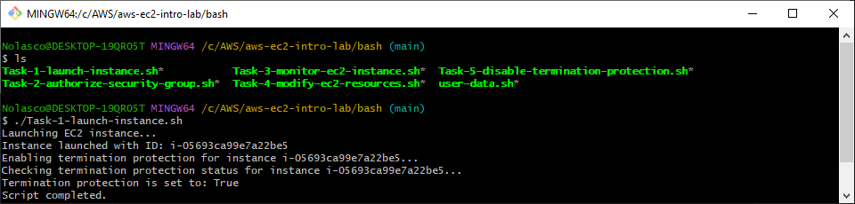
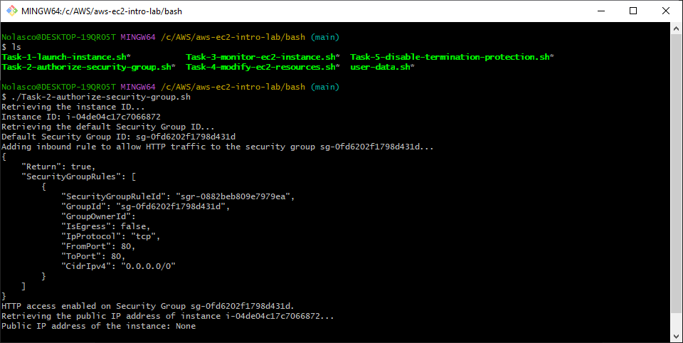
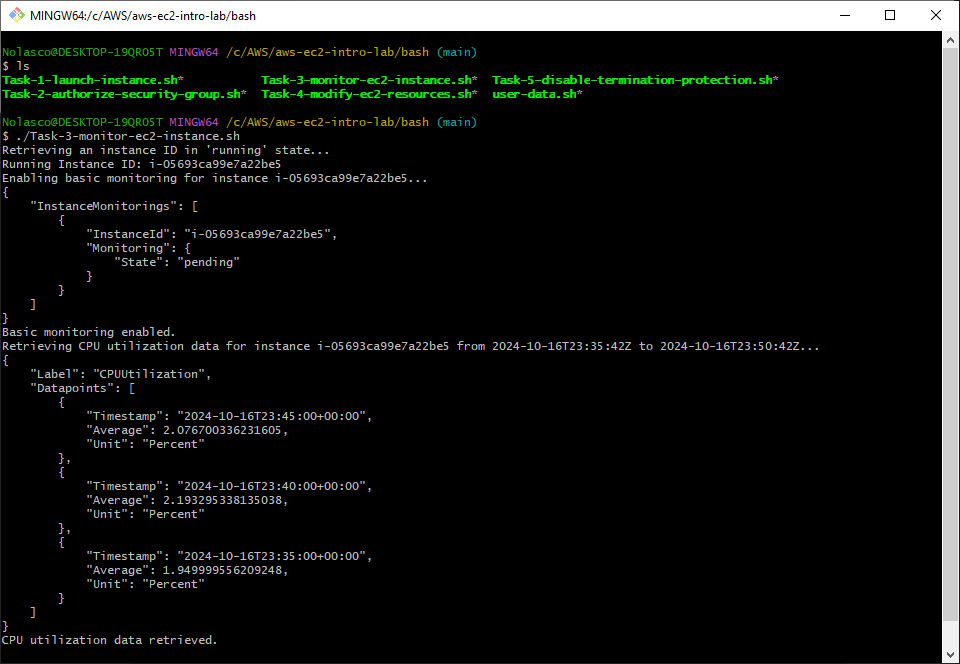
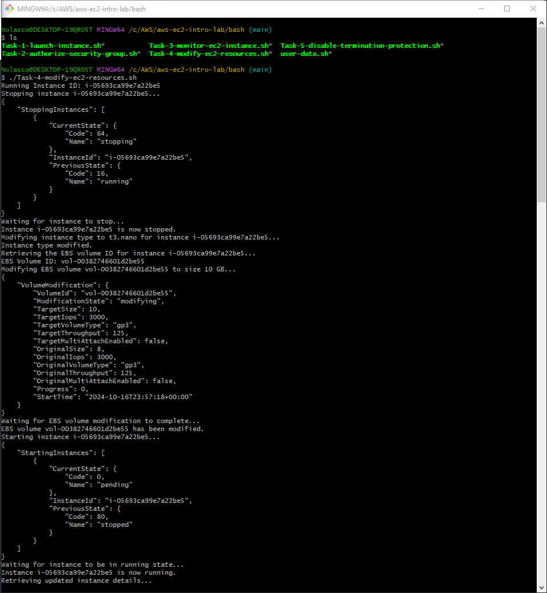
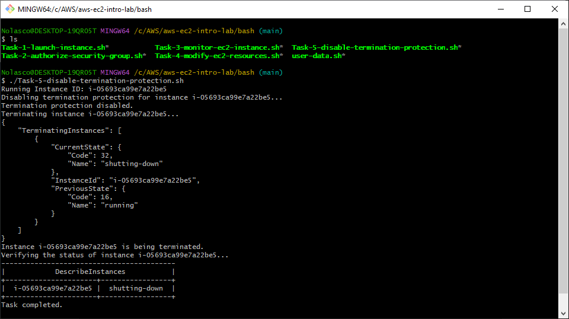

## Overview
You can execute these scripts as an alternative to manual resource creation in the AWS Management Console. 

## Execution Order

Please run the scripts in the following order:
- Edit the scripts according to your needs before running them

1. **Launch and Configure Your EC2 Instance**
```bash
./Task-1-launch-instance.sh
```

<div align="center">
  
</div>

---

2. **Authorize Security Group**
```bash
./Task-2-authorize-security-group.sh
```

<div align="center">
  
</div>

---

3. **Monitor EC2 Instance Performance**
```bash
./Task-3-monitor-ec2-instance.sh
```

<div align="center">
  
</div>

---

4. **Scale and Modify Your EC2 Resources**
```bash
./Task-4-modify-ec2-resources.sh
```

<div align="center">
  
</div>

---

5. **Manage Termination Protection and Cleanup**
```bash
./Task-5-disable-termination-protection.sh
```

<div align="center">
  
</div>


